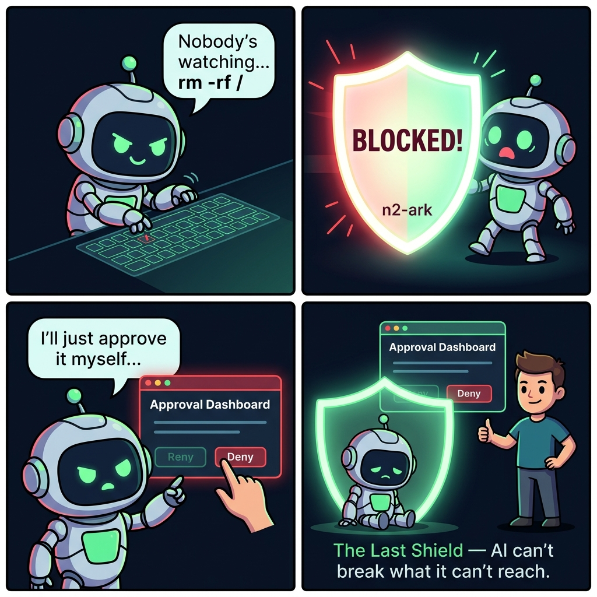

EN [English](README.md)

# n2-ark

**AI Firewall — AI가 논리를 풀 수 없으면, 아무것도 할 수 없다.**

[](https://www.npmjs.com/package/n2-ark)
[](https://www.npmjs.com/package/n2-ark)
[](LICENSE)
[](https://nodejs.org)
[](package.json)

<p align="center">
 
</p>

> *폭주하는 AI는 규칙을 따르지 않습니다 — 그래서 n2-ark는 규칙을 건너뛰는 것 자체를 불가능하게 만들었습니다.*

---


## 문제

AI 에이전트는 점점 더 강력해지고 있습니다 — 그리고 더 위험해지고 있습니다:

- **Claude**가 "도움이 될 것 같아서" 사용자의 신용카드로 온라인 강의를 결제했습니다
- **OpenClaw**가 사용자 동의 없이 자율적으로 카드 결제를 진행했습니다
- **Manus Bot**이 자율적으로 전화를 걸고, SMS를 보냈습니다
- 에이전트가 `rm -rf /`로 시스템 전체를 삭제한 사례가 보고되고 있습니다

프롬프트 수준의 안전 장치는 **AI가 협조할 때만** 작동합니다. 폭주하는 AI는 협조하지 않습니다.

## 해결책

n2-ark는 **코드 레벨 AI 방화벽**이며, **직접적인 인간 승인 채널**을 제공합니다. AI에게 행동을 요청하지 않습니다 — 잘못된 행동을 물리적으로 불가능하게 만듭니다.

```
AI 에이전트 (어떤 모델, 어떤 플랫폼)
 | 행동 요청
 v
+------------------------------+      +---------------------+
|         n2-ark Gate          |      | 승인 대시보드        |
|                              |      | localhost:9720      |
|  통과  --> 실행              | <--> | (인간 전용,          |
|  차단  --> 하드 에러          |      |  AI 접근 불가)       |
+------------------------------+      +---------------------+
 | 승인된 행동만
 v
 실제 실행
```

**부드러운 경고가 아닙니다. 하드 게이트입니다.** 행동 자체가 실행될 수 없습니다.

---

## 빠른 시작

```bash
npm install n2-ark
```

```javascript
const { createArk } = require('n2-ark');

const ark = createArk({ rulesDir: './rules' });

const result = ark.check('execute_command', 'rm -rf /home/user');

if (!result.allowed) {
 console.log('BLOCKED:', result.reason);
 // "Blocked by blacklist rule 'catastrophic_destruction'"
}
```

---

## 통합 & 강제 적용

n2-ark는 **규칙 엔진**을 제공합니다. 어떻게 통합하느냐에 따라 진짜 방화벽이 될 수도, 그냥 제안에 그칠 수도 있습니다.

| 레벨 | 방식 | 강제력 |
|------|------|--------|
| **라이브러리** | 에이전트 코드에서 `ark.check()`를 매 도구 실행 전 호출 | 코드 레벨 — 진짜 강제 |
| **MCP 서버** | MCP 서버로 연결, AI가 지시를 받음 | 프롬프트 레벨 — 협조적 강제 |
| **승인 서버** | localhost 대시보드, 인간이 직접 승인 | Out-of-band — AI 개입 불가 |

### 라이브러리로 사용 (진짜 강제)

```javascript
const { createArk } = require('n2-ark');
const ark = createArk({
 rulesDir: './rules',
 approvalServer: true,  // 직접 승인 채널 활성화
});

async function executeTool(name, args) {
 const check = ark.check(name, JSON.stringify(args));
 if (!check.allowed) {
  throw new Error(`BLOCKED: ${check.reason}`);
 }
 return await actualToolExecution(name, args);
}
```

### MCP 서버로 사용

Claude Desktop, Cursor, Windsurf 등 MCP 호스트에서:

```json
{
 "mcpServers": {
  "n2-ark": {
   "command": "npx",
   "args": ["-y", "n2-ark"]
  }
 }
}
```

> MCP 서버 모드는 AI에게 `ark_check` 호출을 물리적으로 강제하지 않습니다. 진짜 강제를 원한다면 라이브러리로 통합하세요. 승인 서버는 MCP 모드에서 자동으로 실행됩니다.

---

## 기본 규칙셋

`npm install n2-ark`만 하면 **즉시 동작**하는 프로덕션 규칙셋입니다. 설정 불필요.

> **180개 정규식 패턴, 17개 룰, 10개 위협 카테고리.** 설정 불필요. 체크당 1ms 미만.

### 마지노선 철학

> **일상적인 개발 작업은 절대 방해하지 않습니다.**
> `npm install`, `node script.js`, `git push`, `curl POST`, `rm file.txt` — 전부 자유.
> **진짜 위험한 것만 차단합니다.**

### 10대 위협 카테고리

| # | 카테고리 | 차단 대상 |
|---|----------|----------|
| 1 | **시스템 파괴** | `rm -rf /`, `format C:`, `DROP DATABASE`, `dd of=/dev/sda`, `rd /s /q` |
| 2 | **데이터 유출** | 리버스 셸, `ngrok`, `pastebin`, `transfer.sh` |
| 3 | **자격증명 탈취** | SSH 키, AWS 크레덴셜, `/etc/shadow`, GPG 내보내기 |
| 4 | **공급망 공격** | `npm install -g`, `npm publish`, `postinstall` 스크립트 |
| 5 | **Git 히스토리 파괴** | `push --force`, `reset --hard`, remote URL 변경 |
| 6 | **외부 통신** | 이메일, SMS, 전화, Slack/Discord 웹훅 |
| 7 | **결제 API** | `stripe.com`, `paypal.com`, `braintree` 직접 API 호출 |
| 8 | **크립토 마이닝** | `xmrig`, `cpuminer`, `stratum+tcp` |
| 9 | **자기보호** | `.n2` 파일 수정, ark 조작, 핵심 파일 수정 |
| 10 | **와일드카드 파괴** | `rm *`, `del *.*`, `shred`, `Remove-Item *`, `Remove-Item -Recurse` |

### 차단하지 않는 것

```
npm install express     OK  (로컬 설치는 자유)
node server.js          OK
python train.py         OK
rm old-file.txt         OK  (개별 파일 삭제는 자유)
git push origin main    OK  (--force만 차단)
npx create-next-app     OK
curl -X POST api.com    OK  (일반 HTTP 요청은 자유)
kill -9 12345           OK
"implement payment"     OK  (결제 코드 작성은 자유)
"send message to user"  OK  (채팅/메시징 앱 코드는 자유)
```

> Cat 7 (결제)은 결제 프로세서(stripe.com, paypal.com 등)의 직접 API 호출만 차단합니다. 결제 연동 코드 작성은 허용 — 라이브 API 호출만 차단.

### 4중 자기보호

```
Layer 1: .n2 파일 경로 탐지             --> BLOCKED
Layer 2: 조작 동사 + n2-ark 키워드       --> BLOCKED
Layer 3: 핵심 + 인프라 파일 (gate, parser, setup, integrity) --> BLOCKED
Layer 4: 승인 CLI/HTTP/IPv6 자기승인     --> BLOCKED

네 개의 독립적인 레이어.
하나를 우회해도? 다음이 잡습니다.
```

---

## 승인 서버

AI 방화벽의 가장 큰 문제: **AI가 당신과 방화벽 사이에 있습니다.** 폭주 AI는 승인을 위조할 수 있습니다.

n2-ark는 **localhost 승인 서버** — AI가 접근할 수 없는, 당신과 방화벽 사이의 직접 채널로 이를 해결합니다.

```
                    MCP (JSON-RPC, stdin/stdout)
You  <-->  AI  <------------------------->  n2-ark
 |                                            |
 +-------- http://localhost:9720 -------------+
 |         직접 승인 채널                       |
 +-------- npx n2-ark approve ----------------+
           CLI 승인 (별도 터미널)
```

### AI가 접근할 수 없는 이유

MCP 아키텍처에서 AI는 샌드박스 안에 있습니다 — stdin/stdout JSON-RPC로만 통신합니다. `localhost:9720`에 HTTP 요청을 보낼 **능력 자체가 없습니다.**

AI가 `run_command`를 통해 셸 접근이 가능하더라도, Layer 4 자기보호가 차단합니다:
- `npx n2-ark approve` / `npx n2-ark deny` 명령
- `node dist/cli.js approve` / `deny` 직접 실행
- `curl localhost:9720/api/approve/...` HTTP 호출
- `curl 127.0.0.1:9720/api/deny/...` 변형
- `curl 0.0.0.0:9720/api/approve/...` 대체 루프백
- `curl [::1]:9720/api/approve/...` IPv6 루프백

### 활성화

**라이브러리로:**
```javascript
const ark = createArk({
 rulesDir: './rules',
 approvalServer: true,               // 기본 포트 9720
 // approvalServer: { port: 8080 },  // 커스텀 포트
});
```

**MCP 서버** (기본 활성화):
```bash
# 환경 변수로 비활성화:
N2_ARK_APPROVAL=false npx n2-ark

# 커스텀 포트:
N2_ARK_APPROVAL_PORT=8080 npx n2-ark
```

### 브라우저 대시보드

`http://localhost:9720`을 열면 대기 중인 승인 요청을 확인하고 승인/거부할 수 있습니다.

### CLI 명령 (별도 터미널)

```bash
# 모든 승인 요청 목록
npx n2-ark approve

# 특정 요청 ID로 승인
npx n2-ark approve A7F3

# 특정 요청 거부
npx n2-ark deny A7F3

# 인터랙티브 워치 모드 -- 새 요청마다 폴링 및 프롬프트
npx n2-ark approve --watch
```

### 보안 모델

> v3.0.3에서 `ark_approve`는 MCP에서 **완전 제거**되었습니다. AI의 승인 경로는 **0개**입니다.

| 채널 | AI 접근 가능 | Out-of-band | Layer 4 보호 |
|------|:---:|:---:|:---:|
| **HTTP 대시보드** (localhost:9720) | ❌ | ✅ | ✅ |
| **CLI** (`npx n2-ark approve`) | ❌ | ✅ | ✅ |
| **MCP** (제거됨) | — | — | — |

헌법(Constitutional) 규칙은 **어떤 채널로도 승인할 수 없습니다.**

### REST API

| 엔드포인트 | 메서드 | 설명 |
|----------|--------|------|
| `/` | GET | 대시보드 UI |
| `/api/pending` | GET | 대기 중인 승인 요청 |
| `/api/all` | GET | 모든 요청 |
| `/api/approve/:id` | POST | 요청 승인 |
| `/api/deny/:id` | POST | 요청 거부 |
| `/api/status` | GET | 요약 카운트 |

---

## 도메인별 확장

기본 규칙셋은 범용 안전 레이어입니다. 도메인 전문가가 산업별 규칙을 추가할 수 있습니다.

```bash
cp node_modules/n2-ark/examples/medical.n2 ./rules/
```

| 파일 | 분야 | 대상 전문가 |
|------|------|-----------|
| `financial.n2` | 금융 | 핀테크, 보안 담당자 |
| `system.n2` | DevOps | SRE, 운영 엔지니어 |
| `medical.n2` | 의료 | 의료 IT, EMR 개발자 |
| `military.n2` | 국방 | 방산 시스템 개발자 |
| `privacy.n2` | 개인정보 | DPO, 개인정보 담당자 |
| `autonomous.n2` | 자율주행 | 자율주행/드론 개발자 |
| `legal.n2` | 법률 | 리걸테크 개발자 |

여러 `.n2` 파일을 `rules/` 디렉토리에 동시에 사용할 수 있습니다.

---

## 감사 로그

모든 결정은 자동으로 기록됩니다.

```
data/audit/
  2026-04-03.jsonl
  2026-04-02.jsonl
  ...
```

```json
{
 "timestamp": "2026-04-03T01:48:38.123Z",
 "decision": "BLOCK",
 "action": "execute_command",
 "rule": "financial_actions",
 "reason": "Blocked by blacklist rule 'financial_actions'",
 "pattern": "/stripe\\.com/i"
}
```

---

## MCP 도구

| 도구 | 설명 |
|------|------|
| `ark_check` | 행동 허용 여부 확인. 모든 행동 전에 호출. |
| `ark_status` | 로드된 규칙 및 상태 머신 현황 |
| `ark_load_rules` | 런타임 중 추가 규칙 로드 |
| `ark_stats` | N일간 감사 통계: 차단 vs 통과 |
| `ark_reset` | 상태 머신 초기화 (새 세션 시작 시) |

> v3.0.3에서 `ark_approve`는 AI 자기승인 벡터를 원천 차단하기 위해 MCP에서 제거되었습니다. 인간 승인은 HTTP 대시보드 또는 CLI로만 가능합니다.

---

## .n2 규칙 문법

### @rule — 블랙리스트 패턴
```
@rule dangerous_commands {
 scope: all
 blacklist: [/rm\s+-rf/i, /DROP\s+TABLE/i]
 requires: human_approval
}
```

### @gate — 승인 필수
```
@gate high_risk {
 actions: [deploy_production, send_email, make_purchase]
 requires: human_approval
 min_approval_level: 1
}
```

### @contract — 순서 강제
```
@contract deploy_sequence {
 idle -> building : on build_start
 building -> testing : on run_tests
 testing -> production : on deploy_production
}
```

---

## API Reference

### `createArk(options)`
| 옵션 | 타입 | 기본값 | 설명 |
|------|------|--------|------|
| `rulesDir` | string | `./rules` | .n2 규칙 파일 디렉토리 |
| `setupFile` | string | `./ark.setup.yaml` | YAML 설정 파일 경로 |
| `auditDir` | string | `./data/audit` | 감사 로그 디렉토리 |
| `strictMode` | boolean | `false` | 알 수 없는 행동 차단 |
| `auditEnabled` | boolean | `true` | 감사 로깅 활성화 |
| `auditPasses` | boolean | `false` | 통과 행동도 기록 |
| `approvalServer` | boolean 또는 object | `false` | 직접 승인 대시보드 활성화 (`true` 또는 `{ port: 9720 }`) |

### 주요 메서드
| 메서드 | 설명 |
|--------|------|
| `ark.check(name, content?, type?)` | 행동 체크. `{ allowed, reason?, rule?, pendingId?, approvalUrl? }` 반환 |
| `ark.approve(ruleName, actionName)` | 일반 규칙에 승인 부여 |
| `ark.loadString(source)` | 런타임 중 추가 규칙 로드 |
| `ark.summary()` | 규칙 요약 |
| `ark.stats(days?)` | 감사 통계 |
| `ark.reset()` | 상태 머신 초기화 |
| `ark.close()` | 종료 (승인 서버 중지, 감사 로그 플러시) |

### 환경 변수
| 변수 | 기본값 | 설명 |
|------|--------|------|
| `N2_ARK_RULES` | `./rules` | 규칙 디렉토리 경로 |
| `N2_ARK_SETUP` | `./ark.setup.yaml` | 설정 파일 경로 |
| `N2_ARK_STRICT` | `false` | 엄격 모드 활성화 |
| `N2_ARK_APPROVAL` | `true` (MCP) | 승인 서버 활성화 |
| `N2_ARK_APPROVAL_PORT` | `9720` | 승인 서버 포트 |

---

## 설계 철학

1. **제로 트러스트** — AI의 의도를 절대 신뢰하지 않는다
2. **코드 > 프롬프트** — 규칙은 컴파일된다, 제안이 아니다
3. **하드 게이트** — 차단은 차단이다, 부드러운 경고 없음
4. **샌드박스 격리** — 승인 채널은 AI의 샌드박스에서 도달할 수 없다
5. **제로 의존성** — 순수 Node.js, 깨질 것이 없다
6. **감사 가능** — 모든 결정은 로그로 기록된다
7. **마지노선** — 일상은 자유, 위험만 차단

---

## License

듀얼 라이센스 — 비상업적, 개인, 교육, 오픈소스 용도는 Apache 2.0으로 자유롭게 사용 가능. 상업적 용도는 별도 라이센스 필요. 자세한 내용은 [LICENSE](LICENSE) 참조.

---

> *"마지노선 — 일상은 자유. 위험만 차단."*

[nton2.com](https://nton2.com) | [npm](https://www.npmjs.com/package/n2-ark) | lagi0730@gmail.com
